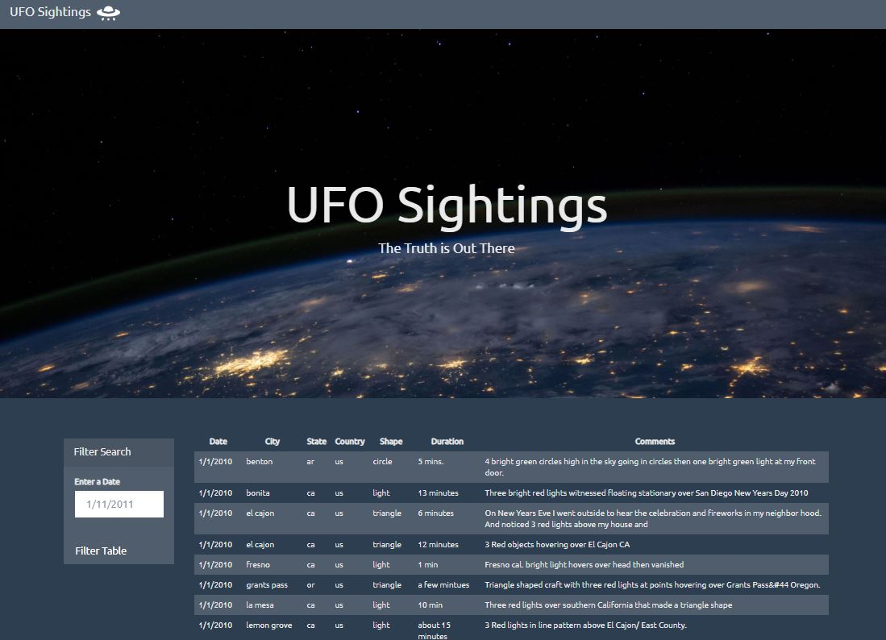
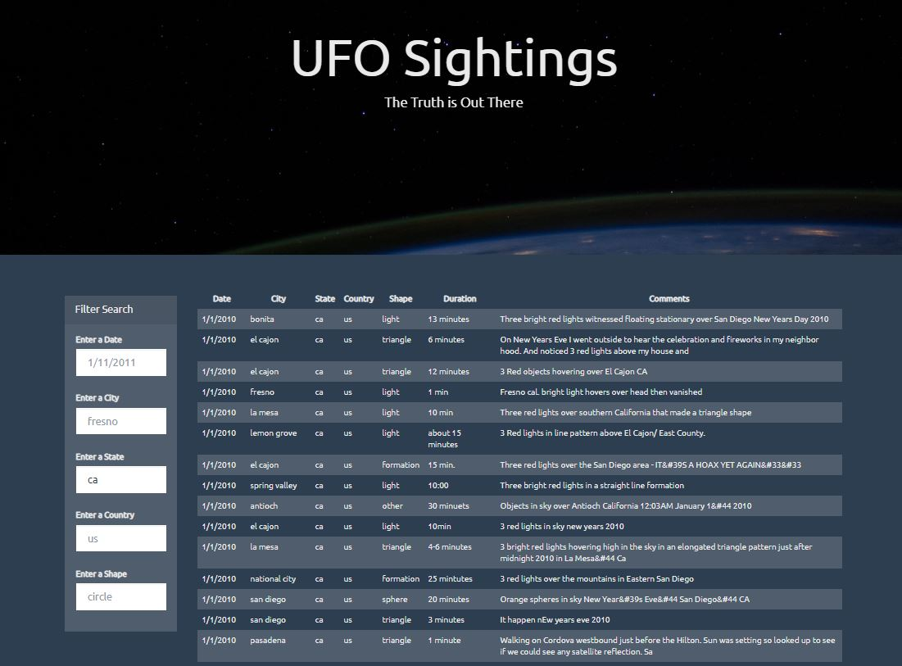

# JavaScript-Challenge

The extra-terrestrial menace has come to Earth and we here at *ALIENS-R-REAL* have collected all of the eye-witness reports we could to prove it! All we need to do now is put this information online for the world to see and then the matter will finally be put to rest.

There is just one tiny problem though... our collection is too large to search through manually. Even our most dedicated followers are complaining that they are having trouble locating specific reports in this mess.

That's where I come in. I will write a code that will create a table dynamically based upon a dataset provided by *ALIENS-R-REAL*. The table will allow users to filter the data for specific values. The catch is, *ALIENS-R-REAL* only uses pure JavaScript, HTML, and CSS, and D3.js on their web pages. Have no fear! I know these trusted coding languages and will share what we have found with the planet Earth! 

### UFO Level 1 
The [UFO dataset]( UFO-level-1/static/js/data.js) provided was formatted as an array of JavaScript objects. I built a basic HTML web page and wrote code to append a table with data for each UFO sighting. My code includes a table filter based on users input date and activated using event listeners. 

### UFO Level 2  
Similar to level 1, I built out the same HTML web page and table for UFO sightings. My level 2 code includes multiple filters based on user input. The level 2 code filters the table based on the following criteria: date, city, state. Country, and shape. 

